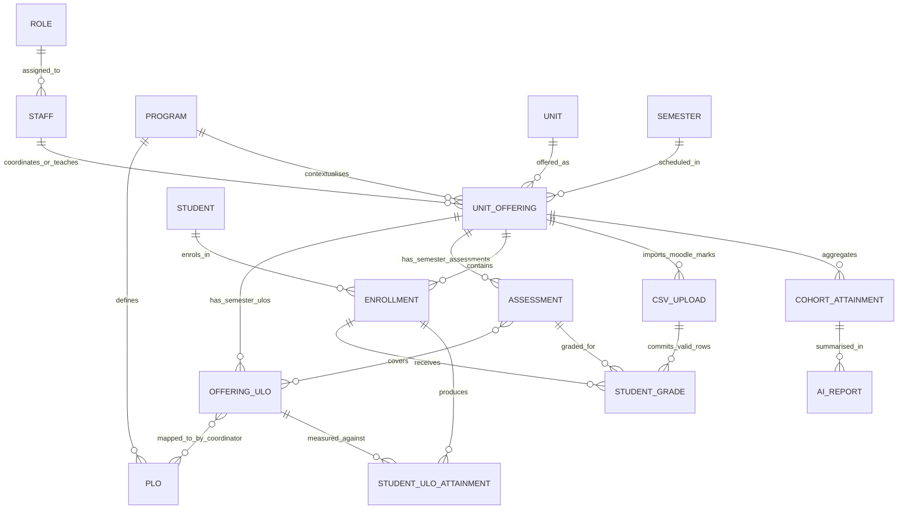

# Report-Friendly ERD Recommendation

Use this version in the project proposal report if the team wants to include an ERD. The full implementation schema in `ERD.md` is useful as backup evidence, but it is too detailed for the main report body.

Report-ready files:

- `ERD_report_final_01_setup.svg`
- `ERD_report_final_02_results.svg`
- PNG exports are also available as `ERD_report_final_01_setup.png` and `ERD_report_final_02_results.png`.

## Recommendation

For the report:

- Put the system architecture diagram in the Methodology section as the main required integration diagram.
- Include this simplified ERD only if there is space in Methodology or as an optional appendix.
- Do not paste the full 23-table DDL into the report body.
- Keep the full `ERD.md` as implementation backup or an optional database-schema appendix.
- Prefer the final two-part ERD files above. They are clearer than one large all-in-one ERD because the database has two different concerns: semester setup/mapping and grade calculation/reporting.

Reason: the report rubric rewards clear methodology, data collection/processing, and labelled diagrams. A large physical schema with upload-row, upload-issue, index, and audit tables will likely be unreadable in the body and distract from the main methodology.

## Simplified Conceptual ERD Source

The Mermaid version below is retained as source/reference only. For the actual report, use the final SVG/PNG files listed above.

## Report Explanation Paragraph

The database design stores stable academic structures separately from semester-specific teaching data. A `Unit Offering` connects a unit, program, and semester, because ULO wording and assessment structures can change each semester. Handbook scraping can prefill offering-specific ULOs, assessments, and assessment-to-ULO links, but the Unit Coordinator confirms ULO-to-PLO mappings each semester. Moodle CSV uploads are validated before committed grades are stored. The calculation engine then produces per-student ULO attainment and cohort-level attainment summaries, which are used by the dashboard and local LLM report generation.

## What This Simplifies From The Full ERD

The full implementation schema includes extra support tables for:

- CSV upload column mappings, raw rows, and validation issues.
- Historical or keyword-based ULO-PLO mapping suggestions.
- Active/inactive mapping audit fields.
- Composite foreign keys to prevent cross-semester data mistakes.
- Indexes and implementation-level constraints.

These are important for implementation, but they should be explained in prose or kept in backup material rather than shown as a dense main report diagram.

## Best Placement

Preferred option:

1. Methodology body: system architecture diagram.
2. Methodology body or optional appendix: simplified conceptual ERD above.
3. Backup/internal material: full `ERD.md` implementation schema.

Use this caption if the ERD is included:

> Figure X. Simplified conceptual ERD showing semester-specific unit offerings, ULOs, assessments, Moodle CSV grade imports, LO attainment calculation, and cohort-level AI reporting.
