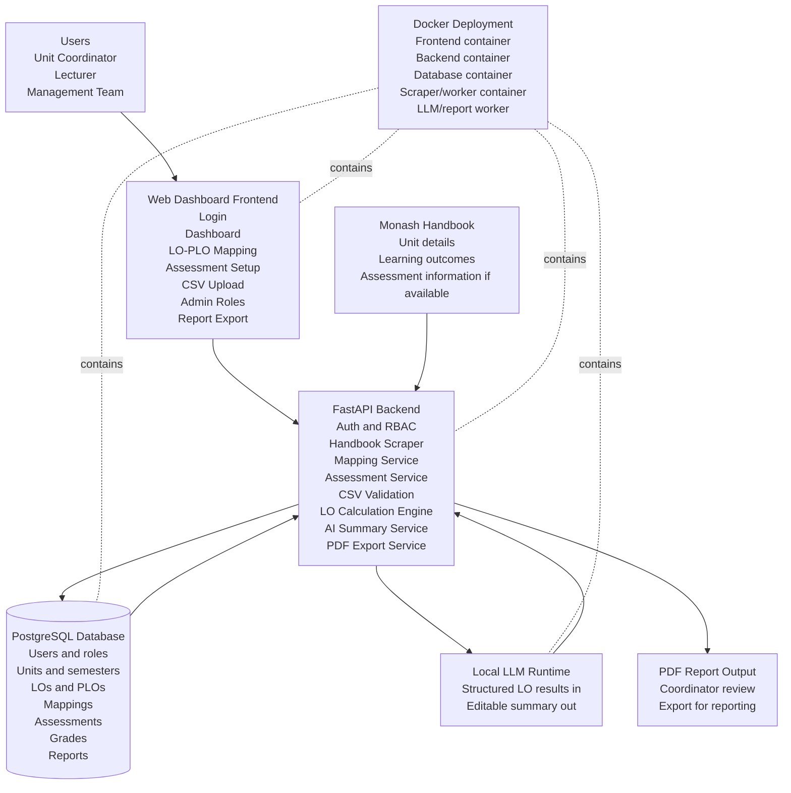

# Slide 9 System Architecture Guide

Use this for the final proposal's software design slide. This should be Slide 9, after the UI walkthrough slides.

## Simplified Slide Version

The presentation slide should use only five main blocks:

1. Users
2. Web dashboard
3. Backend engine
4. PostgreSQL and local LLM
5. Docker deployment

Do not place every backend module as a separate large box on the slide. Keep the detailed list in speaker notes or backup.

## One-Sentence Explanation

> Users configure units and upload grades through the dashboard; the backend validates data, calculates LO attainment, stores results in PostgreSQL, uses a local LLM to draft summaries, and exports reports as PDF.

## Main Decision

Use a system architecture diagram, not ERD, as the main Slide 9.

Reason:

- The final proposal asks for software design of main portions of the project.
- Your audience can understand architecture faster than a database ERD.
- It connects directly to requirements: role access, Handbook scraper, CSV upload, LO calculation, dashboard, local LLM, report export, Docker.
- ERD can be kept as backup if a marker asks about database tables.

## What The Slide Should Prove

The architecture should prove this sentence:

> Users interact with a role-based dashboard. The backend collects Handbook and CSV data, stores it in PostgreSQL, calculates LO attainment, sends structured results to a local LLM for summary generation, and exports editable reports as PDF.

## Recommended Slide Heading

For the current presentation theme, keep the large heading as:

> Architecture

Use the subtitle:

> System Architecture

Then let the caption or speaker line carry the actual message:

> A role-based dashboard connects Handbook data, CSV grades, LO calculations, local AI summaries, and PDF reporting.

## Architecture Layers

For the slide, show five simple parts.

### 1. Users

User roles:

- Unit Coordinator
- Lecturer
- Management Team

Why this matters:

- Directly maps to Slide 5 stakeholders.
- Supports the role-based access requirement.

What each user does:

- Unit Coordinator: reviews mappings, assessments, dashboard, summaries, report export.
- Lecturer: sets assessments, uploads grades, views LO attainment.
- Management Team: manages users/roles and views filtered dashboards/reports.

### 2. Web Dashboard

Label:

- Web dashboard frontend

Screens:

- Mapping
- Assessments
- CSV upload
- Reports
- Admin roles, if space allows

Important wording:

- Current prototype is static HTML/wireframe.
- Final implementation can be React.
- Do not imply the current HTML is already a full production app.

### 3. Backend Engine

Label:

- Backend engine / FastAPI

Modules:

- Handbook scraper service
- CSV validation and reconciliation service
- LO attainment calculation engine
- PDF export service

Mention authentication and role permissions verbally, but avoid crowding the slide.

Why this matters:

- This layer proves the system has real backend logic, not only UI screens.
- It shows where the calculation engine belongs.

### 4. PostgreSQL and Local LLM

Data storage:

- PostgreSQL database

Tables/entities to mention:

- Users
- Roles
- Units
- Semesters
- Learning Outcomes
- Program Learning Outcomes
- LO-PLO mappings
- Assessments
- Assessment-LO links
- Student grades
- Reports

AI:

- Local LLM runtime

Important:

- Do not say external AI API in the final deck.
- Say local LLM to match privacy and project decision.
- Local LLM receives structured performance results, not raw uncontrolled prompts.

### 5. Docker Deployment

Label:

- Docker deployment

Containers:

- Frontend container
- Backend/API container
- PostgreSQL container
- Worker/scraper container
- Local LLM/report worker container

Why this matters:

- Directly supports the deployment/infrastructure requirement.
- Shows the system can be run consistently across team machines or server.

## Data Flow To Show In Speaker Notes

Use this as speaker logic. The slide itself does not need all ten arrows.

1. Users log in and access screens based on role.
2. Handbook scraper imports unit and LO information.
3. Coordinator confirms LO-PLO and assessment-LO mappings.
4. Lecturer uploads CSV grades.
5. Backend validates and reconciles rows.
6. Calculation engine distributes assessment weights across tagged LOs.
7. PostgreSQL stores calculated student/cohort LO attainment.
8. Dashboard visualises LO results and risk indicators.
9. Local LLM generates editable student/cohort summary.
10. User exports PDF report.

## Simplified Diagram Structure

Use this layout:

```text
[Users] -> [Web Dashboard] -> [Backend Engine]
                            -> [PostgreSQL + Local LLM]
                            -> [PDF Report]

Docker wraps the implementation for consistent deployment.
```

## Mermaid Version

You can paste this into Mermaid Live Editor, Obsidian, Notion, GitHub Markdown preview, or any tool that supports Mermaid.



## Slide Speaker Script

Use this script for Slide 9:

> This slide shows the proposed system architecture. At the top are our three main user groups: Unit Coordinator, Lecturer, and Management Team. They interact with the dashboard frontend, which contains the screens we showed earlier: login, dashboard, LO-PLO mapping, assessment setup, CSV upload, admin roles, and report export.
>
> The frontend sends requests to a FastAPI backend. The backend is responsible for the main system logic: authentication, role permissions, Handbook scraping, mapping setup, CSV validation, LO attainment calculation, AI summarisation, and PDF export.
>
> PostgreSQL stores the structured academic data, including users, roles, units, semesters, learning outcomes, program learning outcomes, mappings, assessments, grades, and generated reports.
>
> For AI reporting, we use a local LLM runtime. The backend sends structured LO attainment results to the model, and the model returns an editable summary. This keeps the AI step controlled and supports the privacy direction of the project.
>
> Finally, we plan to containerise the system with Docker so the frontend, backend, database, scraper or worker process, and AI/report service can run consistently during development and deployment.

## Short Version For Faster Presentation

If time is limited:

> The architecture has four main parts: a web dashboard for users, a FastAPI backend for validation and calculation, PostgreSQL for structured academic data, and a local LLM for report summaries. Handbook data and CSV grades flow into the backend, the calculation engine computes LO attainment, and users view the results on the dashboard or export them as PDF reports. Docker will keep the deployment consistent.

## What To Say If Asked Why Not ERD

Answer:

> At proposal stage, system architecture is more useful because it explains how the main modules work together. The ERD is still important, but it is better as backup material because it goes deeper into database relationships. For this presentation, we want to show the whole system flow clearly.

## What To Say If Asked About WSM

Answer:

> We are not using WSM as a main slide because the final proposal requires a strict 14-slide structure and WSM is not listed as one of the required sections. However, we still used WSM as supporting evidence for choosing a local LLM based on privacy, cost, technical effort, and accuracy.

## Common Mistakes To Avoid

Avoid these:

- Do not say external AI API.
- Do not make the diagram too detailed with every possible database table.
- Do not show ERD as Slide 9 unless your supervisor asks.
- Do not put WSM into Slide 9.
- Do not make Docker look like the main feature; it is only deployment support.
- Do not show attendance unless your team confirms attendance is in scope.
- Do not claim the current HTML prototype is already the final React app.

## Final Slide 9 Checklist

Your Slide 9 is correct if it includes:

- Users and roles.
- Frontend dashboard screens.
- FastAPI backend.
- Handbook scraper.
- CSV validation.
- LO calculation engine.
- PostgreSQL database.
- Local LLM summarisation.
- PDF report export.
- Docker deployment.
- Clear arrows showing data flow.
